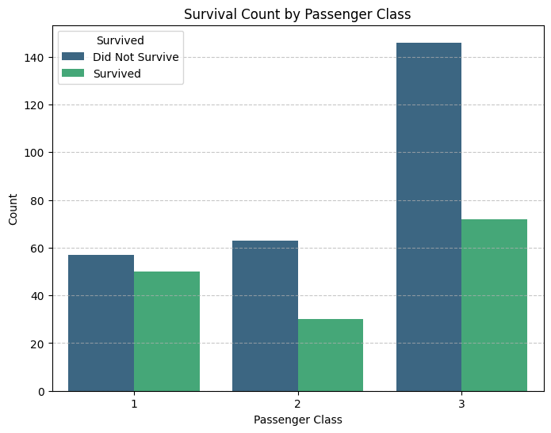

# Titanic-Dataset-Analysis-
This data was retrieved from kaggle.com
I conducted an exploratory data analysis of the Titanic dataset using Python to identify the key factors associated with passenger survival. The project involved data cleaning, preprocessing, exploratory data analysis, statistical analysis, and data visualization to uncover meaningful patterns within the dataset.
I analyzed variables such as passenger class, gender, age, fare, family size, and embarkation point to examine their relationship with survival outcomes. Missing values were handled appropriately, and the data was transformed and visualized using Python libraries to communicate the findings clearly.
The analysis provided insights into survival patterns across different passenger groups and demonstrated how data analysis can be used to identify relationships and generate evidence-based business insights.
Tools & Skills: Python, Pandas, NumPy, Matplotlib, Seaborn, Data Cleaning, Exploratory Data Analysis (EDA), Data Visualization, Statistical Analysis, and Data Interpretation.

